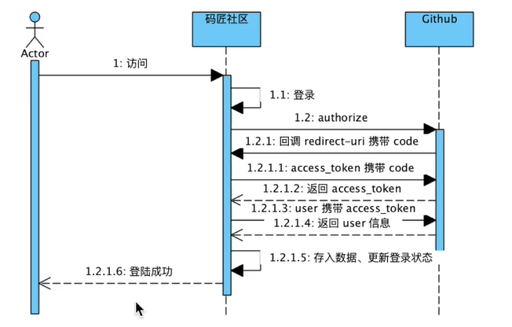

# 学习GitHub上的开源项目问题社区
哈哈哈 加油

## 资料
[Spring WEB文档](https://spring.io/guides/gs/serving-web-content/)

[Spring 文档](https://spring.io/guides)

[原项目GitHub地址](https://github.com/codedrinker/community)

[增加GitHub登录功能](https://docs.github.com/en/developers/apps/building-oauth-apps)

[BootStrap 文档](https://v3.bootcss.com/getting-started/)

[thymeleaf 文档](https://www.thymeleaf.org/index.html)

[okhttp 文档](https://square.github.io/okhttp/)

[springboot整合mybatis 文档](https://mybatis.org/spring-boot-starter/mybatis-spring-boot-autoconfigure/)

[springmvc 文档](https://docs.spring.io/spring-framework/docs/current/reference/html/web.html#mvc)
## 工具
git

github

[lombok](https://projectlombok.org/features/all)

[flyway 文档 一个数据库迁移工具](https://flywaydb.org/documentation/getstarted/firststeps/maven)

[Mybatis Generator](http://mybatis.org/generator/index.html)

## 功能
### 使用GitHub账号登录


### 使用flyway进行数据库的迁移
执行以下命令会自动执行数据库脚本
```shell
mvn flyway:migrate
```

## MySQL数据库
```sql
create table user
(
	ID int auto_increment
		primary key,
	account_id varchar(100) null,
	name varchar(50) null,
	token char(36) null,
	gmt_create bigint null,
	gmt_modified bigint null
);
alter table user
    add bio varchar(256) null;

create table question
(
    id int auto_increment,
    title VARCHAR(50) null,
    description text null,
    gmt_create bigint null,
    gmt_modified bigint null,
    creator int null,
    comment_count int default 0 null,
    view_count int default 0 null,
    like_count int default 0 null,
    tag varchar(256) null,
    constraint question_pk
        primary key (id)
);
```

## Mybatis Generator
```shell
mvn -Dmybatis.generator.overwrite=true mybatis-generator:generate
```